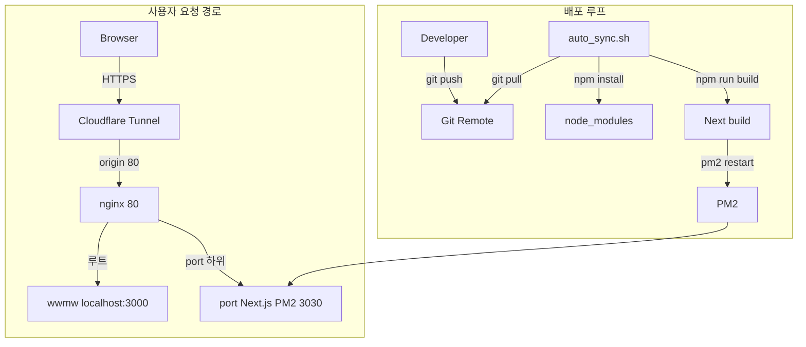

## 아키텍처 / 설계

### 기술 스택

| 구분       | 선택                                                     |
| ---------- | -------------------------------------------------------- |
| 프레임워크 | Next.js                                                  |
| 콘텐츠     | [Contentlayer](https://contentlayer.dev/) + MDX·마크다운 |
| 스타일     | Tailwind CSS,                                            |
| 배포 단위  | Node 서버 (`next start`), **PM2**로 상시 실행            |

### 설계 의도

- **Next.js 선택 이유**: 페이지 라우팅/SSR·정적 생성 등 **콘텐츠 중심 사이트에 필요한 렌더링 옵션**을 한 프레임워크에서 유연하게 선택할 수 있음.
- **Tailwind 선택 이유**: 작은 UI 반복이 많은 포트폴리오 특성상 **컴포넌트 단위로 빠르게 스타일을 조합**할 수 있고, 타이포그래피(글 콘텐츠) 품질을 `@tailwindcss/typography`로 일관되게 맞출 수 있음.
- **DB를 두지 않은 이유**: 포토폴리오 같은 콘텐츠는 업데이트가 빈번하지 않아 **파일 기반으로 버전 관리**하고, 빌드 시 Contentlayer로 인덱싱해 **운영 복잡도** 를 줄이는 게 목표. (필요해지면 조회수·댓글 등부터 외부 API/DB로 분리 확장 가능)
- **서브 경로 배포**: wwmw.shop도메인은 똑같은 서버에서 운영중 도메인 하위 `/port`에만 서비스되도록 고정.
- **콘텐츠 파이프라인**: 글·문서는 **파일 기반**으로 두고, 빌드 시 Contentlayer가 페이지를 생성 → Next가 페이지로 노출. 에디터 없이 Git으로 콘텐츠 버전 관리 가능.
- **운영**: PM2로 재시작·로그·부팅 복구. 쉘 스크립트로 로 원격 변경 시 빌드·재기동.

### 아키텍처 다이어그램



- **위**: 외부에서 들어오는 HTTP(S) 흐름(Cloudflare → nginx → `/` vs `/port` 분기).
- **아래**: 코드 반영을 위한 루프(git → 빌드 → PM2 재시작). **같은 `portfolio` 노드**를 nginx가 프록시하고 PM2가 띄운 프로세스로 보면 됨.

---

## 트러블슈팅

### 장애분석 사례 1) `/`와 `/port`를 함께 운영하려고 했더니 라우팅이 꼬임

- **증상**: 하나의 도메인에서 `wwmw.shop`(기존 서비스)와 `wwmw.shop/port`(포트폴리오)를 같이 운영하려는데, 터널/프록시 구성이 애매해서 경로 분기가 불안정.
- **원인**: Cloudflare Tunnel이 nginx 앞단이 아니라 **포트폴리오 포트(3030)** 를 직접 바라보고 있었음, nginx 레벨에서 `/`·`/port` 경로 기반으로 책임을 명확히 나누기 어렵고 **도메인 루트(`/`)가 포트폴리오 앱의 `/`로만** 가게 됨.
- **해결**: Cloudflare Tunnel의 origin을 **nginx(:80)** 로 고정하고, nginx에서 경로별 프록시로 분리.
  - `/` → `localhost:3000`
  - `/port` → `localhost:3030`
- **문서**: [링크](https://wwmw.shop/port/portfolio/nabongsun2)

### 장애분석 사례 2) 배포 버전에서 `public` 이미지가 안 보임

- **증상**: 로컬에서는 이미지가 보이는데, 배포 후 일부 이미지가 깨짐.
- **원인**: `img src="/portfolios/xxx.jpg"` 처럼 **루트 절대경로**로 요청되어 `https://wwmw.shop/portfolios/...` 로 나가고, nginx가 이를 `/`로 판단해 **다른 서비스(예: 3000)** 로 프록시해버림.
- **해결**: `basePath`를 하드코딩하지 않고 `NEXT_PUBLIC_BASE_PATH`로 관리해, 이미지 경로를 `${basePath}/...`로 조립. 운영에서는 `NEXT_PUBLIC_BASE_PATH=/port`.
- **문서**: [링크](https://wwmw.shop/port/blog/%EB%B0%B0%ED%8F%AC%EB%B2%84%EC%A0%84_%EC%9D%B4%EB%AF%B8%EC%A7%80_%EC%95%88%EB%82%98%EC%99%80%EC%9A%94)

---

## Getting Started (Development)

```bash
npm install
npm run dev
```

Open [http://localhost:3030/port](http://localhost:3030/port) with your browser to see the result when you run with `next dev -p 3030` and `basePath: "/port"`.

---

## Production with PM2 (3030 포트, /port basePath)

### 1. 빌드

```bash
npm install
npm run build
```

### 2. PM2로 앱 실행

```bash
# 이름은 원하는 대로 변경 가능 (예: port-app)
pm2 start npm --name "port-app" -- start
```

위 명령은 `package.json`의 `"start": "next start -p 3030"` 스크립트를 사용해서
Next.js 프로덕션 서버를 3030 포트로 실행합니다.

### 3. PM2 상태 확인 / 재시작 / 중지

```bash
# 상태 확인
pm2 ls

# 재시작
pm2 restart port-app

# 중지
pm2 stop port-app

# 삭제
pm2 delete port-app
```

### 4. 서버 재부팅 시 자동 시작 설정

```bash
pm2 startup
pm2 save
```

이렇게 설정하면 서버가 재부팅되어도 `port-app` 프로세스가 자동으로 다시 올라옵니다.

---

## 자동 동기화·배포 (`script/auto_sync.sh`)

WWE 프로젝트와 비슷하게, **Git 원격 변경을 주기적으로 당겨오고** `npm run build` 후 **PM2로 다시 띄우는** 루프 스크립트입니다. **Linux/macOS** 서버에서 사용하는 것을 전제로 합니다.

### 준비

```bash
npm install -g pm2
chmod +x script/auto_sync.sh
```

### 실행 (포그라운드)

프로젝트 루트에서:

```bash
./script/auto_sync.sh
```

로그는 `logs/auto_sync.log`에 **추가(append)** 되며, 터미널에도 같이 출력됩니다.

### 백그라운드 예시

```bash
nohup ./script/auto_sync.sh > /dev/null 2>&1 &
```

### 환경 변수 (선택)

| 변수                 | 기본값                       | 설명                                       |
| -------------------- | ---------------------------- | ------------------------------------------ |
| `AUTO_SYNC_BRANCH`   | `master`                     | 추적할 브랜치                              |
| `AUTO_SYNC_REMOTE`   | `origin`                     | 원격 이름                                  |
| `AUTO_SYNC_INTERVAL` | `30`                         | `git fetch`/헬스체크 주기(초)              |
| `PM2_APP_NAME`       | `port-app`                   | PM2 프로세스 이름                          |
| `APP_PORT`           | `3030`                       | 포트 (lsof 정리용)                         |
| `APP_HEALTH_URL`     | `http://127.0.0.1:3030/port` | `curl` 헬스체크 URL                        |
| `CLOUDFLARED_TUNNEL` | (비움)                       | 쓰려면 터널 이름 설정, 비우면 터널 안 띄움 |

Cloudflare 터널을 쓰는 경우:

```bash
export CLOUDFLARED_TUNNEL="내터널이름"
./script/auto_sync.sh
```

`ecosystem.config.js`가 있으면 스크립트가 `pm2 start ecosystem.config.js`로 기동합니다 (이 레포에 포함됨).
